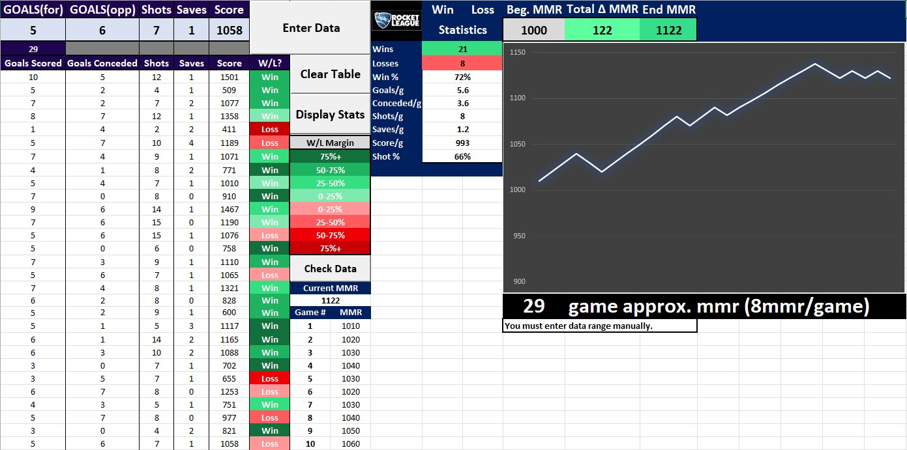

# RL_Data_Project
I learned VBA in an MIS class in college and that got me hooked on programming. This was the first technical project that I created with that new skill and it was a great learning experience.

I developed this project as a way to merge my likeness for Rocket League with practical implementation of VBA code in Excel and working with Excel in general. My primary focus for this project was to keep as much code as I can in VBA, and not rely too heavily on cell functions to push me out of my comfort zone and build familiarity with VBA.

## Main Page 
 
- The user manually plugs in their data for a single game in the top left, and submits it by hitting the "Enter Data" button.
- The "Clear Table" button truncates all the data from the table.
- The "Display Stats" button shows the trend of our estimated MMR (Match Making Rating) and some other stats from our data table.
- I didn't have a good computer to play on in college, so I partially used this project as an excuse to use my friends custom PC with a 3070 super while I entered data on my slow laptop.